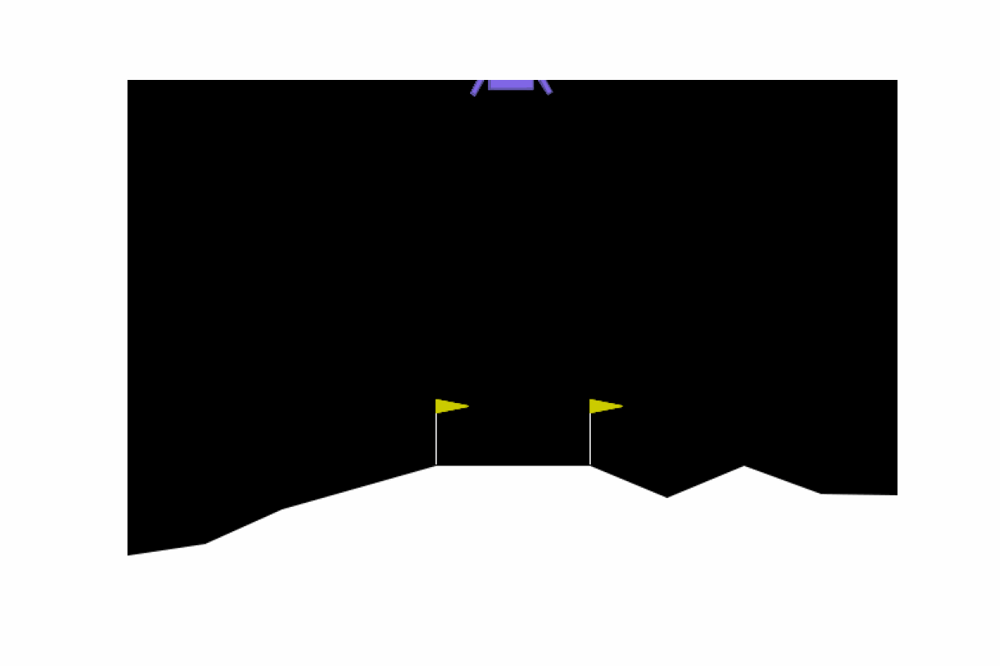
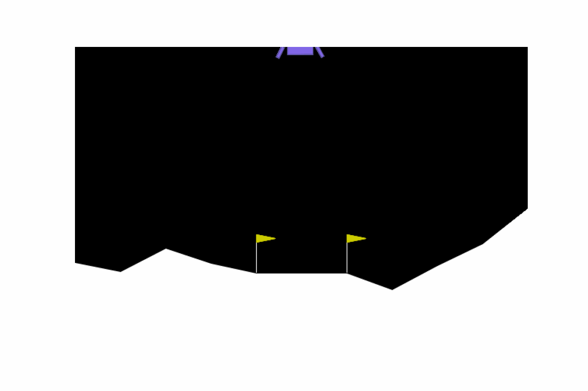

# Introduction
In this repository, you can explore our case studies and their implementation. This repository first presents some visual results observed in the causal analysis part of the paper. It then provides an overview of the implementation details of the proposed algorithm on two case studies: Lunar Lander and Mountain Car from OpenAI Gym.

## Analysis

<p float="left">
  
   
</p>


<br>
<br>
In the above GIF images, you can observe two distinct scenarios: the left one results in success, while the right one ends in failure. In both scenarios, there is a wind blowing from left to right. In the scenario on the right, the lander attempts to counteract the wind by extensively using its right engine, but it overcompensates, causing the lander to tilt and become unstable. Consequently, it drifts too far to the left, missing the landing pad and crashing. In the scenario on the left, the lander effectively utilizes its right engine to maintain control and successfully lands.


## Experiments
Before running this code, ensure you have installed the required packages listed in `requirements.txt`.


```bash
pip install -r requirements.txt
```

### Lunar Lander
#### Generating Data
To begin generating traces, we first need to train the networks. For this purpose, you can use the `network_train.py` script.<br>
*Note: You can modify the neural network architecture in `network_train.py` by adjusting the `networks` variable in lines 181-188. Similarly, you can customize the `wind` variable by defining a list for it.*
```bash
python /Lunar_lander/traces/network_train.py
```
Now that we have the desired networks, we need to run different scenarios to obtain various traces with different initial values for vertical speed (`vel_y`) and horizontal speed (`vel_x`). Use the following command to achieve this:
```bash
python /Lunar_lander/traces/gen_trace.py
```
To generate traces for a single scenario, use the command below:
```bash
python /Lunar_lander/traces/single_gen_trace.py
```
*Note: The operations mentioned above might take a long time to complete. You can use pre-trained networks and traces located in `Lunar_lander/traces/networks` for networks and `/Lunar_lander/traces/trace_log` for traces to save time.*
#### Run Experiments
To run experiments with the **Abs_DA** algorithm mentioned in the paper, use the code below. You can adjust the value of alpha (`α`) in the range [0, 1] and the number of traces in the range [0, 8980]:
```bash
python /Lunar_lander/src/abs_da.py --init_parm=<α> --init_trace=<No. traces>  
```
To run experiments with the **Abs_Z3** algorithm mentioned in the paper, use the code below. You can adjust the value of alpha (`α`) in the range [0, 1] and the number of traces in the range [0, 8980]:
```bash
python /Lunar_lander/src/abs_z3.py --init_parm=<α> --init_trace=<No. traces>  
```
To run experiments with the **Only_DA** and **Only_Z3** algorithm mentioned in the paper, use the code below: You can adjust the value the number of traces in the range [0, 8980]:
```bash
python /Lunar_lander/src/da.py --init_trace=<No. traces>  
python /Lunar_lander/src/z3.py --init_trace=<No. traces>  
```
*Note: The provided data include around 9000 traces. However, you can generate additional traces using the generating codes in `Lunar_lander/traces`.*

### Mountain Car
#### Generating Data
Same as Lunar Lander we begin with generating traces, to generate traces , use the command below:
```bash
python /Mountain_car/traces/gen_traces.py
```
*Note: You can also modify the initial velocity (`vel`) and initial position (`pos`) inside the for loop in lines 14-18 of `/Mountain_car/traces/gen_traces.py`. Currently, they are set as `pos=[-1.2, -1.1, ..., 0.6]` and `vel=[-0.07, -0.06, ..., 0.07]`.*

#### Run Experiments
To run experiments with the **Abs_DA** algorithm mentioned in the paper, use the code below. You can adjust the value of alpha (`α`) in the range [0, 1] and the number of traces in the range [0, 10280]:
```bash
python /Mountain_car/src/abs_da.py --init_parm=<α> --init_trace=<No. traces>  
```
To run experiments with the **Abs_Z3** algorithm mentioned in the paper, use the code below. You can adjust the value of alpha (`α`) in the range [0, 1] and the number of traces in the range [0, 10280]:
```bash
python /Mountain_car/src/abs_z3.py --init_parm=<α> --init_trace=<No. traces>  
```
To run experiments with the **Only_DA** and **Only_Z3** algorithm mentioned in the paper, use the code below: You can adjust the value the number of traces in the range [0, 10280]:
```bash
python /Mountain_car/src/da.py --init_trace=<No. traces>  
python /Mountain_car/src/z3.py --init_trace=<No. traces>  
```
*Note: The provided data include around 10000 traces. However, you can generate additional traces using the generating codes in `Mountain_car/traces`.*
